# Jenkins Pipeline for Microservice Build and Deployment


---
## Overview

This Jenkins **Declarative CI pipeline** standardizes the build and integration process for Java-based microservices.  
It automates:

- Source code checkout  
- Build and unit testing  
- Code quality and security scans  
- Artifact publishing (JAR and Docker images)  
- Triggering downstream CD pipelines  

The pipeline is designed to be **centrally governed** by the Middleware / DevOps team and **consumed by implementation teams** with minimal configuration.

---

## Who Should Read This?

- **Implementation Teams** – to onboard and use the pipeline  
- **Middleware / DevOps Team** – to configure and maintain the CI Jenkins  
- **Managers / Leads** – to understand responsibilities, ownership, and flow  

---

## Ownership & Responsibilities

### Middleware / DevOps Team (Jenkins Owners)

Responsible for **central and one-time setup**:

- Jenkins server and agent configuration  
- Jenkins plugin installation  
- Jenkins global tools (Java, Maven, NodeJS)  
- Docker installation on Jenkins agents  
- SonarQube server integration and webhook configuration  
- Artifactory (JFrog) access  
- Jenkins credentials creation and maintenance  
- Dependency-Track server setup (if enabled)  
- Creation of CI and downstream CD Jenkins jobs  

📌 **All Jenkins-level work is tracked in the JIRA:**  
**[Request for Jenkins Server Configurations for Consulting-Base Microservice CI](https://appzillon.atlassian.net/browse/MSG-2790)**

---

### Implementation Teams (Pipeline Consumers)

Responsible for **project-level onboarding and execution only**:

- Initiating onboarding request to Middleware team  
- Cloning the pipeline repository  
- Creating / using Jenkins CI job provided by Middleware  
- Updating project-specific parameters  
- Triggering CI builds and validating results  

🚫 **Implementation teams must NOT**:

- Install Jenkins plugins or tools  
- Create or rotate credentials  
- Modify Jenkins global configuration  
- Hardcode secrets in Jenkinsfiles  

---
## Table of Contents

1. [Prerequisites](#prerequisites)
2. [End-to-End Onboarding Flow](#end-to-end-onboarding-flow-mandatory)
3. [Pipeline Parameters](#pipeline-parameters)
4. [CI Architecture](#ci-architecture)
5. [Pipeline Stages](#pipeline-stages)
6. [Environment Variables](#environment-variables)
7. [Security & Credentials](#security--credentials)
8. [Security & Quality Enforcement](#security--quality-enforcement)
9. [Post-Build Actions](#post-build-actions)
10. [Service Port Mapping](#service-port-mapping)
11. [Usage Instructions](#usage-instructions-implementation-teams)
12. [Notes](#notes)

---

## Prerequisites

⚠️ **Configured by Middleware / DevOps team only**

### Jenkins Server

**Required plugins:**

- Git Plugin  
- Pipeline Plugin  
- Credentials Binding Plugin  
- Docker Pipeline Plugin  
- SonarQube Scanner Plugin  
- NodeJS Plugin  
- HTML Publisher Plugin  
- JUnit Plugin  

---

### Global Tools (Jenkins)

- Java **21** (Java 17 fallback if required)  
- Maven **3.6+**  
- NodeJS **22.x** (required for SBOM generation)  

---

### Infrastructure & Services

- Docker installed on Jenkins agent  
- GitLab accessible from Jenkins  
- JFrog Artifactory for JAR and Docker uploads  
- SonarQube server accessible from Jenkins  
- Dependency-Track server (optional but recommended)  
- Downstream CD Jenkins job configured  

---

## End-to-End Onboarding Flow (Mandatory)

This section explains **how an implementation team onboards a new microservice**.

---

### Step 1: Initiate Request to Middleware / DevOps Team

Before any Jenkins job is created or triggered, the **implementation team must send an onboarding request** to the Middleware team.

**Purpose:**

- Create Jenkins credentials (username/password, tokens)  
- Create or confirm Jenkins CI job name  
- Confirm downstream CD job availability  
- Validate access to SonarQube, Artifactory, and GitLab  

#### 📧 Sample Email to Middleware Team

```text
Subject: CI Pipeline Onboarding Request – <Project / Microservice Name>

Hi Middleware Team,

We would like to onboard the following microservice to the standard Jenkins CI pipeline.

Project / Product Name:
Microservice Name(s): <accounts / core / onboarding>
GitLab Repository URL:
Target Environments: <dev / sit / uat / prod>

Requesting support for:
- Jenkins credential creation (GitLab, JFrog, SonarQube)
- Jenkins CI job creation
- Confirmation of downstream CD job
- Validation of SonarQube Quality Gate and webhook setup

Please share the Jenkins job name and credential IDs once ready.

Thanks,
<Implementation Team Name>
```
#### Step 2: Middleware / DevOps Team Actions

The **Middleware team performs**:

**Creation of Jenkins credentials:**

- GitLab access token (`read_repository`)  
- JFrog Docker registry credentials  
- JFrog Maven/JAR repository credentials  
- SonarQube authentication token  

**Creation or assignment of:**

- Jenkins CI job name  
- Downstream CD job  

**Sharing with implementation team:**

- Jenkins job name  
- Credential IDs  
- Any Jenkins constraints or known issues  

All activities are tracked in the referenced JIRA ticket.

---

#### Step 3: Clone CI Pipeline Repository (Implementation Team)

- Implementation team clones the **CI pipeline repository** provided by the Product / Middelware team.  
- **Jenkinsfile logic must not be modified.**

**Allowed changes:**

- Project-specific parameter values  
- Credential reference names only (if instructed by Middleware team)  

---

#### Step 4: Jenkins Job Configuration

Implementation team:

- Uses the Jenkins job created by Middleware  
- Configures job as **Pipeline from SCM**  
- Points to:
  - Application Git repository  
  - Jenkinsfile path shared by Middleware  

🚫 **Do not create new credentials or tools.**

---

#### Step 5: Update Credential Reference Names (If Required)

If Middleware provides credential IDs different from defaults, the implementation team may update **only the credential reference names** in the Jenkinsfile, such as:

- `GITLAB_CREDS`  
- `jfrog-cred`  
- `jfrog-push-cred`  
- `SONAR_TOKEN`  

⚠️ **Secrets must never be added directly to the Jenkinsfile.**

---

## Pipeline Parameters

| Parameter                | Type   | Description                     | Default                      |
| ------------------------ | ------ | ------------------------------- | ---------------------------- |
| `ARTIFACTORY_TYPE`       | Choice | Artifactory type                | jfrog                        |
| `JFROG_DOCKER_REPO`      | String | Docker repository name          | appzillon-banking-docker     |
| `JFROG_JAR_REPO`         | String | JAR repository name             | appzillon-banking            |
| `GIT_URL`                | String | Base Git URL for microservices  | Provided                     |
| `MICROSERVICE_NAME`      | Choice | Microservice to build           | accounts/core/onboarding     |
| `MICROSERVICE_BRANCH`    | String | Git branch to build             | dev                          |
| `GIT_CICD_URL`           | String | CI/CD pipeline repo             | Provided                     |
| `PIPELINE_BRANCH`        | String | Pipeline repo branch            | main                         |
| `BUILD_MICROSERVICE_TAG` | String | Artifact version tag            | v1                           |
| `ENV`                    | Choice | Target environment              | dev/sit/uat/qa/pre-prod/prod |
| `DEP_SCAN`               | Choice | Run dependency & security scans | Yes / No                     |
| `RUN_TESTS`              | Choice | Run Maven tests                 | yes / no                     |
| `BUILD_TYPE`             | Choice | Artifact type                   | jar / docker / both          |
| `SECURITY_ENFORCEMENT`   | Choice | Security behavior               | STRICT / SOFT                |

---

---
## CI Architecture

```mermaid
flowchart LR
    Dev[Developer] -->|Commit| GitLab
    GitLab -->|Webhook| Jenkins

    Jenkins --> Init[Init & Port Mapping]
    Init --> Checkout[Checkout Code & CI Config]

    Checkout --> Secrets[TruffleHog Secrets Scan]

    Checkout --> Build[Maven Build<br/>JDK 21]
    Build --> Tests[Unit Tests]

    Tests --> Sonar[SonarQube Analysis]
    Sonar --> QGate{Quality Gate}

    QGate -->|OK| Continue
    QGate -->|FAIL + STRICT| Stop[Pipeline Fails ❌]
    QGate -->|FAIL + SOFT| Warn[UNSTABLE ⚠️]

    Build --> SBOM[Dependency-Track SBOM]

    Continue --> DockerCtx[Prepare Docker Context]
    DockerCtx --> DockerBuild[Docker Image Build]

    DockerBuild --> Trivy{Trivy Scan}

    Trivy -->|PASS| Publish
    Trivy -->|FAIL + STRICT| Stop
    Trivy -->|FAIL + SOFT| Warn

    Publish --> JFrogDocker[JFrog Docker Repo]
    Build --> JFrogJar[JFrog JAR Repo]

    JFrogDocker --> CD[Trigger CD Pipeline]
```


---

## Pipeline Stages

### 1. Initialize Workspace & Ports

* Dynamically assigns a service port based on microservice name
* Enables or disables scanning logic

### 2. Clean Workspace

* Removes any files from previous builds

### 3. Checkout Sources (Parallel)

* **Microservice Source**: Clones selected microservice repository
* **CI Config Source**:

  * Maven `settings.xml`
  * Dockerfile
  * Security scan utilities

---

### 4. Secrets Scan – TruffleHog

* Scans the full workspace for exposed secrets
* Generates:

  * JSON report
  * HTML report
* Reports are archived in Jenkins

---

### 5. Build Microservice JAR

* Maven build using **JDK 21**
* Uses secured JFrog credentials
* Supports internal product or domain services repositories

---

### 6. Run Tests *(Optional)*

* Executes Maven unit tests
* Publishes JUnit reports
* Controlled by `RUN_TESTS`

---

### 7. SonarQube Analysis – Java

* Static code analysis
* Code coverage via JaCoCo
* Analyzes:

  * Source code
  * Unit tests
  * Compiled binaries

---

### 8. Sonar Quality Gate

* Enforces SonarQube quality gate
* Behavior controlled by `SECURITY_ENFORCEMENT`:

  * **STRICT** → Pipeline fails
  * **SOFT** → Pipeline marked UNSTABLE

---

### 9. Dependency Scan (Dependency-Track)

* Generates SBOM using `cdxgen`
* Uploads dependency data to Dependency-Track
* Executed only if `DEP_SCAN = Yes`

---

### 10. Prepare Docker Context

* Copies built JAR
* Injects generic Dockerfile
* Runs only for `docker` or `both`

---

### 11. Build Docker Image

* Builds Docker image with:

  * Service name
  * Service port
* Tags image using `BUILD_MICROSERVICE_TAG`

---

### 12. Trivy Image Scan

* Scans Docker image for:

  * HIGH
  * CRITICAL vulnerabilities
* Generates HTML vulnerability report
* Enforcement depends on `SECURITY_ENFORCEMENT`

---

### 13. Push Docker Image

* Pushes image to **JFrog Artifactory**
* Runs only for `docker` or `both`

---

### 14. Push JAR to Artifactory

* Uploads JAR to JFrog repository
* Runs only for `jar` or `both`

---

### 15. Trigger CD Pipeline

* Automatically triggers downstream **CD Jenkins job**
* Passes:

  * Image name
  * Image tag
  * Environment
* Runs asynchronously

---

## Environment Variables

| Variable           | Description                |
| ------------------ | -------------------------- |
| `ARTIFACTORY_HOST` | JFrog host                 |
| `REGISTRY_URL`     | Docker registry URL        |
| `REGISTRY`         | Docker repo path           |
| `REGISTRY_CRED`    | Docker push credentials    |
| `JAR_REPO`         | JAR repository path        |
| `SONAR_TOKEN`      | SonarQube authentication   |
| `SERVICE_PORT`     | Microservice-specific port |

---

## Security & Credentials

The pipeline securely uses Jenkins-managed credentials:

* `GITLAB_CREDS` – GitLab repository access
* `jfrog-push-cred` – Docker image push
* `jfrog-cred` – JAR upload
* `SonarQube` – SonarQube server config
* Product & Platform credentials for Maven dependencies

> 🔐 No secrets are hardcoded in the pipeline.

---

## Security & Quality Enforcement

| Mode       | Behavior                                  |
| ---------- | ----------------------------------------- |
| **STRICT** | Fails pipeline on security/quality issues |
| **SOFT**   | Marks build UNSTABLE and continues        |

Applies to:

* SonarQube Quality Gate
* Trivy image scan

---

## Post-Build Actions

* Publishes:

  * JUnit reports
  * Trivy HTML reports
  * TruffleHog reports
* Archives security artifacts
* Prints build status to Jenkins console
* Triggers CD pipeline on success

---

## Service Port Mapping

| Microservice          | Port |
| --------------------- | ---- |
| onboarding            | 8281 |
| onboardingadmin       | 8282 |
| core                  | 8283 |
| adminconfig           | 8284 |
| accounts              | 8285 |
| transfer              | 8286 |
| payment               | 8287 |
| cards                 | 8288 |
| externalapi           | 8289 |
| pfm                   | 8290 |
| paymentgateway        | 8291 |
| transferscheduler     | 8292 |
| paymentscheduler      | 8293 |
| notificationscheduler | 8294 |
| onboardingmock        | 8295 |

---

## Usage Instructions (Implementation Teams)

1. Ensure Jenkins server setup is completed (refer JIRA)

2. Create Jenkins pipeline job

3. Point to the provided Jenkinsfile

4. Select required parameters

5. Trigger build and monitor results

---
## Notes

* Supports **JAR-only**, **Docker-only**, or **combined builds**
* Security scans are optional and configurable
* Parallel checkout reduces build time
* Designed for **enterprise CI/CD with governance**
* Easily extendable for:

  * Multi-arch Docker builds
  * Blue/Green or Canary deployments
  * Vault-based secrets management

---
